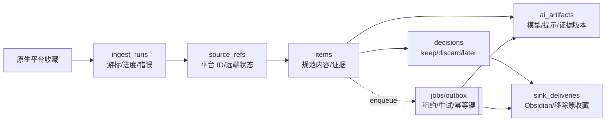

# 闪念安全、架构与产品价值审查报告

> 审查周期：2026-08-15—2026-08-19<br>
> 授权范围：用户授权的本地仓库、运行配置和只读 SQLite 聚合检查<br>
> 基线：`0b4ca25`（任何本轮改动前已推送到 `origin/main`）<br>
> 结论：有价值，但不是“另一个 AI 书签库”；应聚焦“原生收藏债务的快速分流与可追溯交付”。

> 当前主机数据卷仅余约 2.5 GiB（94% 已用）。本轮没有执行 Docker build/pull；镜像构建已放入 CI，部署前仍需在空间充足的环境验证。

## 执行摘要

从第一性原理看，保存一个 URL 本身没有价值。用户真正获得价值，需要完整走完：捕获到真实来源 → 拿到足够证据 → 做出保留/丢弃决定 → 可靠交付到知识库或原平台 → 日后再次使用。

可以把实际价值近似写成：

```text
实际价值 ≈ 捕获覆盖率 × 证据可靠率 × 决策完成率 × 交付成功率 × 后续复用率
```

任一环节接近零，前面的 AI、搜索和界面投入都不会产生最终价值。审查快照中 170 张活动卡片全部仍在 inbox，48 张 AI 失败、81 张没有摘要、63 张未分类。这只说明“捕获/索引已经发生，决策/交付尚未闭环”，不能单独证明或否定产品市场匹配。

通用书签赛道已经高度成熟：Karakeep、Linkwarden、Readwise Reader、Cubox 和 Obsidian Web Clipper 都覆盖了采集、AI、搜索、标注或导出中的大部分组合。闪念可成立的窄楔子是：**用户继续使用封闭平台原生收藏，闪念负责导入、快速决策、可选写回和交付已有知识库**。竞争力来自跨平台状态同步和可靠决策闭环，而不是“AI 摘要”本身。

本轮修复了首次初始化抢占、任意凭证 CORS、SSRF/响应内存上限、代理凭证明文回显、登录限流绕过、任务丢失、前端轮询风暴、搜索语义不一致、FTS 双写、X 导入重复请求、容器权限和零测试/零 CI 等问题。仍然需要的底层重构是把内容、来源、用户决策和外部交付拆成正交实体，而不是继续给 `cards.status` 增加含义。

## Scope、证据与时间线

本报告直接嵌入 scope/evidence/path；仓库没有独立的 `scope.md` 或 `timeline.md`。未读取或输出任何凭证值，只对卡片表做只读聚合。

| Scope 字段 | 值 |
|---|---|
| auth | 用户明确授权本地源码、配置、依赖和运行数据只读审查，并授权修复 |
| in_scope | `apps/`、`packages/`、Docker/Compose、依赖、SQLite schema/聚合、产品闭环 |
| out_of_scope | 未授权的第三方系统攻击、真实 X/AI/MinIO 凭证使用、生产数据修改 |
| network_profile | 只访问公开官方文档/包注册表；功能测试使用临时数据库、内存请求，以及本地 headless Chromium/临时 API 进程 |

### Evidence

| E-id | source_ref | repro_command | content_hash |
|---|---|---|---|
| E-01 | Git 基线 | `git rev-parse --short HEAD`（改动前为 `0b4ca25`） | n/a |
| E-02 | 只读运行快照 | `new Database("data/shannian.db", { readonly: true })` 后执行卡片聚合与 `integrity_check` | n/a |
| E-03 | API 测试 | `npm test` | n/a（15/15 通过） |
| E-04 | 全量构建 | `npm run build` | n/a |
| E-05 | 生产依赖审计 | `npm audit --omit=dev --audit-level=moderate` | n/a（0 vulnerabilities） |
| E-06 | 容器静态验证 | `docker compose config --quiet` | n/a |
| E-07 | 初始化/CORS 复现 | `apps/api/src/app.integration.test.ts` | n/a |
| E-08 | SSRF/大小上限复现 | `apps/api/src/lib/public-fetch.test.ts` | n/a |
| E-09 | 迁移/搜索/完整性复现 | `apps/api/src/services/cards.integration.test.ts` | n/a |
| E-10 | 队列恢复/重试复现 | `apps/api/src/services/enrichment-queue.integration.test.ts` | n/a |
| E-11 | Chromium 用户闭环 | `npm run test:e2e` | n/a（1/1 通过） |
| E-12 | GitHub CI | Actions run `32205825437` | n/a（测试、构建、审计、Docker image build 全通过） |

### Timeline 摘要

1. 检查工作树与历史，把用户已有 Docker 加固改动提交并推送为 `0b4ca25`；
2. 并行完成产品、安全、架构、前端和容器只读审查；
3. 修复初始化、认证、CORS、凭证、SSRF 和输入/响应边界；
4. 引入 SQLite durable enrichment queue、版本迁移、FTS 触发器和完整性 guard；
5. 修复前端轮询/草稿竞态，在 UI 上拆分“保留”与“Obsidian 导出”（领域状态尚未拆分）；
6. 升级有安全公告的依赖，新增确定性测试与 CI；
7. 用临时新库/旧库验证迁移，未修改现有 170 张卡片。

## 发现与处置

| F-id | 严重度 | evidence_ids | confidence | location | 状态 |
|---|---|---|---:|---|---|
| F-01 首次初始化存在并发抢占和双会话 | Critical | E-07 | 高 | `routes/setup.ts` | 已修：所有新库默认一次性 token + SQLite 原子 claim；直接运行默认回环监听 |
| F-02 网页/OG 图片可访问私网且先全量读内存 | Critical | E-08 | 高 | `public-fetch.ts`、`web.ts`、`thumbs.ts` | 已修：逐跳校验、DNS pin、流式上限、图片签名 |
| F-03 任意 Origin 携凭证 CORS，可读写设置 | High | E-07 | 高 | `app.ts` | 已修：生产默认无 CORS、unsafe method 同源检查 |
| F-04 登录限流信任首个 XFF 且 Map 无界 | High | 代码审查,E-07 | 中 | `middleware/auth.ts` | 已修：socket IP、有界 TTL、全局限速、代理 CIDR/hops；已测每客户窗口，代理链仍为代码审查 |
| F-05 敏感设置明文、数据库权限过宽、容器 root | High | E-05,E-06 | 高 | `settings.ts`、Docker | 已缓解：0600/0700、非 root、可选 AES-GCM；默认未提供 key 时仍明文 |
| F-06 enrichment 与 X job 依赖进程内状态，重启丢工作 | High | E-10 | 高 | `enrichment-queue.ts`、`x-import-job.ts` | 部分修复：enrichment 可恢复；X 重启会显式失败但尚不能从 cursor 续跑 |
| F-07 首页永久轮询、详情轮询覆盖草稿 | High | 代码审查,E-04 | 中 | `HomePage.tsx`、`CardPage.tsx` | 已修：只轮询 pending、串行调度、请求版本和 dirty draft；尚缺浏览器竞态测试 |
| F-08 搜索文案与索引不一致，FTS 手工双写非原子 | Medium | E-09 | 高 | `db/index.ts`、`cards.ts` | 已修：索引摘要/描述/摘录，数据库触发器原子维护 |
| F-09 “沉淀”只改状态，前端未调用已有导出 API | Product P0 | 代码审查,E-04 | 中 | `CardPage.tsx`、`cards.ts` | 部分修复：导出按钮/错误/重试独立；成功仍写 `deposited`，不是独立 delivery |
| F-10 X 时间线已有媒体却逐卡再请求 X | High reliability | 代码审查 | 中 | `x-import-job.ts`、`cards.ts` | 已修：媒体一次入库，worker 并发默认 2；尚缺 X fixture 集成测试 |
| F-11 备份文档把本地缩略图误写成 MinIO | High ops | E-06 | 高 | README、`ops-backup.md` | 已修；JSON 明确降级为逻辑副本 |
| F-12 Hono/Drizzle 命中生产依赖公告 | Medium | E-05 | 高 | `apps/api/package.json` | 已修至 Hono 4.13.2、Drizzle 0.45.2 |
| F-13 零测试、零 CI，Docker 安装不可复现 | High engineering | E-03,E-04,E-06,E-11,E-12 | 高 | package scripts、CI、Dockerfile | 已修 API/浏览器 smoke/CI，Dockerfile 使用 `npm ci`，远程 runner 已完成镜像构建 |
| F-14 X 非官方 Cookie/Query ID 是单点政策风险 | Product/ops | E-02 | 高 | `services/import/` | 未消除，只能限速、显式风险和可替换 connector |
| F-15 媒体仍主要引用远程 URL，会自然腐烂 | Product/retention | E-02 | 高 | card `media_json` | 未解决；当前定位应是索引/分流，不是永久归档 |
| F-16 后台富化/AI 可覆盖并发用户编辑 | High integrity | E-09 | 高 | `cards.ts`、card schema | 部分修复：CAS + 用户标题/作者/分类锁；完整 provenance 仍属于目标模型 |

## 攻击与故障路径

### P-01：改动前的首次抢占链

`path_type=attack`，关联 F-01/F-03/F-05：未认证并发调用 setup → 两个请求都完成 bcrypt 并获得 30 天会话 → 跨域调用设置接口 → 把 AI base URL 改到攻击者域 → 测试接口把现有 API key 作为 Bearer 发出。原子 claim、setup token、同源检查和不回显凭证共同切断了这条链，单点补丁不够。

### P-02：改动前的任务丢失链

`path_type=callflow`，关联 F-06/F-07/F-10：写入 card → `setImmediate` 内存任务 → 进程重启后 pending 永久存在 → 首页把“无封面”也当 busy 每 4 秒请求四组元数据 → 选择状态反复清空。现在 card 与 job 在同一 SQLite 中持久化（后续还应做到同一事务 outbox），worker 启动时接管 running/pending，前端只看真实 pending。

## 产品价值判断

### 市场事实

- [Karakeep](https://karakeep.app/pricing/) 已提供自托管、AI 标签、全文搜索、客户端和导出；
- [Linkwarden](https://linkwarden.app/pricing/) 已覆盖整页保存、AI 标签、全文检索、标注和 RSS；
- [Readwise Reader](https://readwise.io/read) 已覆盖 inbox triage、网页/PDF/Newsletter/RSS/YouTube/X 和 Obsidian/Notion 同步；
- [Cubox](https://help.cubox.cc/) 已提供永久快照、AI 摘要/问答/语义检索与多种导出；
- [Obsidian Web Clipper](https://obsidian.md/clipper) 本身免费、本地 Markdown、支持模板与可选 LLM 解释。

因此“收藏 + AI 摘要 + 搜索 + 导出”不是可防御差异。以下是基于事实的推断：闪念只在**不改变原生收藏习惯，又能可靠减少收藏债务**时成立。X 导入只是第一个 wedge，不是护城河。

### 建议用数据证伪，而不是继续堆功能（当前尚未埋点）

| 环节 | 建议阈值 | 低于阈值说明什么 |
|---|---:|---|
| Activation | 首次连接后 24h，≥60% 用户完成至少 10 条分流 | 导入没有降低启动摩擦 |
| Core loop | ≥40% 周活用户每周处理 ≥20 条；中位决策 <12 秒 | AI 卡片增加了阅读负担 |
| Outcome | 保留并导出后 30 天内再次打开/引用 ≥25% | 只是复制，不是知识交付 |
| Debt reduction | 原生收藏库存净下降 ≥20% | 没有减少收藏债务 |
| Trust | AI 建议采纳 ≥60%；原文打开 ≥99%；误删可恢复 100% | 不应扩平台或加模型能力 |
| Willingness to pay | 行为成立后再测试每月 15–30 元 | 若只用一次，适合本地迁移器/开源工具 |

这些是产品实验的否证线，不是已经达成的 KPI。当前系统不能自动计算决策耗时、AI 建议采纳、30 日复用或原生库存净下降；应先增加本地 `decision_events`、`delivery_attempts` 和来源库存基线。原链点击只能作为再次打开的代理指标，不能等同于“引用”。

## 底层架构建议

不要因为“重构”就拆微服务或换 PostgreSQL。单用户 NAS 的正确默认仍是模块化单体 + SQLite：部署简单、备份透明、事务边界强。需要重构的是领域边界和副作用语义。

下面是建议的目标模型；这是逻辑设计，不是已经完成的迁移：



核心原则：

- `items` 不承载外部平台状态；同一内容可有多个 `source_refs`；
- 用户意图写入 append-only `decisions`，AI 只能建议，不能伪装成用户决定；
- Obsidian 导出和移除原收藏都是 `sink_deliveries`，有幂等键、attempt、next_run_at、last_error；
- `jobs` 与产生它的业务写入同一事务，worker 使用 lease，启动回收过期 lease；
- AI 结果记录输入证据版本与模型/提示版本，用户编辑优先；
- UI 只显示 decision 和 delivery 的真实状态，不再用一个 `deposited` 同时表达“想保留”和“已成功写入”。

当前新增的 `enrichment_jobs` 是这条路线的第一个可运行切片，但还不是通用 outbox。

## 优先级路线

### P0：先证明闭环

1. 把 `keep / discard / later` 建成独立 decision，支持批量、快捷键和撤销；
2. 把 Obsidian 与原平台移除建成 durable delivery，显式展示 pending/succeeded/failed；
3. 将 X import 的 cursor、page 和 item checkpoint 入库，重启后续跑而不是只标失败；
4. 删除原收藏进入延迟队列，撤销窗口结束后才写回；
5. 只记录匿名/本地聚合漏斗，验证上一节指标。

### P1：提高可信度

1. 拆 `items/source_refs/ai_artifacts`，保留证据和生成 provenance；
2. 完成正式 schema migration 清单，去掉剩余启动期 ad-hoc `ALTER`；
3. 增加浏览器 E2E：首次初始化、登录、添加、搜索、编辑期间轮询、保留、导出失败/成功；
4. 做 SQLite online backup、缩略图 manifest/checksum 和定期恢复演练；
5. 为远程媒体提供按需归档策略，而不是暗示已永久保存。

### P2：有数据再扩平台

只选择第二个确有原生收藏 API、目标用户重叠且删除语义可恢复的平台。先验证连接成本、增量一致性和写回风险，不用“支持平台数量”制造表面进度。

## 验证结果与残余风险

已完成：

```bash
npm test
npm run build
npm audit --omit=dev --audit-level=moderate
docker compose config --quiet
```

- API 测试 15/15 通过，覆盖 setup 原子抢占、恶意 Origin、SSRF 重定向/DNS 超时、流式上限、密文 fail-closed、旧 FTS 迁移、URL 并发去重、用户字段锁、完整性 guard 和队列恢复/重试；
- shared/API/web 生产构建通过；
- Chromium smoke 1/1 通过，覆盖首次初始化、捕获、跨状态搜索、保留、标题编辑和未配置 MinIO 的导出错误；
- 生产依赖审计为 0；
- fresh DB 与模拟旧 DB 的迁移、FTS 搜索和 `integrity_check` 通过；
- Compose 解析通过，配置声明了默认回环、非 root、只读 rootfs、cap drop、资源/日志限制；GitHub runner 上的最终镜像构建通过。

尚未声称解决：

- 本机磁盘不足，未实际启动最终 Docker 镜像；CI 已构建通过，但带真实 bind mount/反代理/MinIO 的发布前人工验收仍是必要的；
- 当前环境没有 Browser 插件，但已使用仓库 Playwright/Chromium 跑 headless smoke；尚未覆盖编辑中轮询、登录限流和真实 MinIO 成功交付；
- 设置加密是可选项；不配置外部 key 时，数据库中的第三方凭证仍依赖 0600/0700 和宿主机权限保护；
- X import 仍不能断点续跑，非官方接口也无法获得官方稳定性保证；
- enrichment 是 at-least-once：关机等待 8 秒后仍在执行的外部调用会在下次启动重做，可能产生重复请求；
- 远程媒体、网页原文和 Obsidian 对象没有端到端完整性校验；
- health 尚未验证磁盘可写、MinIO/AI、备份年龄；
- 当前 `cards` 仍混合内容、决定和交付字段，目标模型需要分阶段迁移。

最终判断：继续投资是有条件合理的，但下一阶段的成功标准不是“更多 AI 或更多平台”，而是用户是否能更快清空原生收藏、可靠交付少量真正有用的内容，并在未来再次使用它们。
